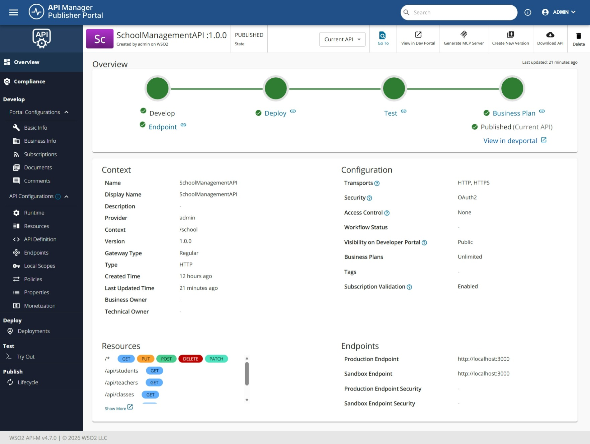
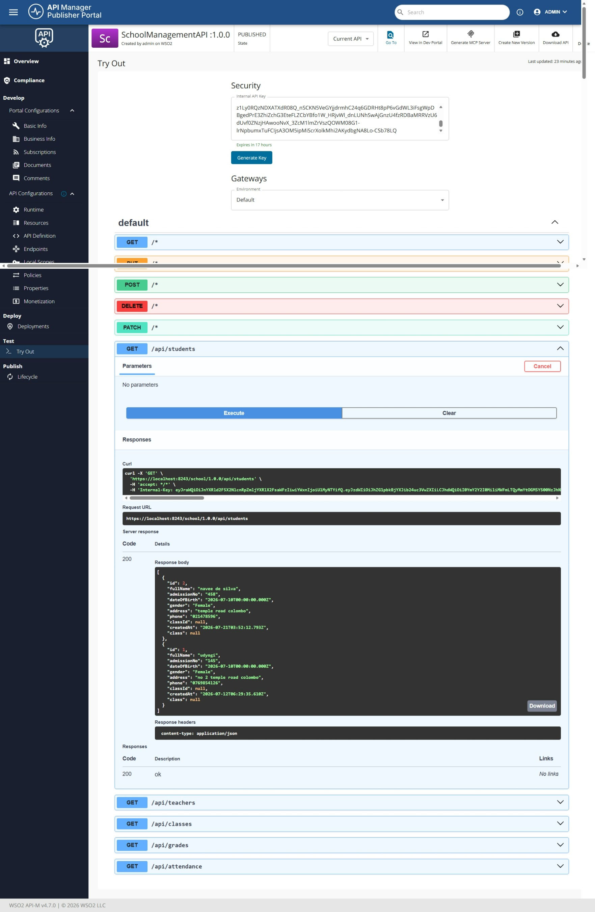
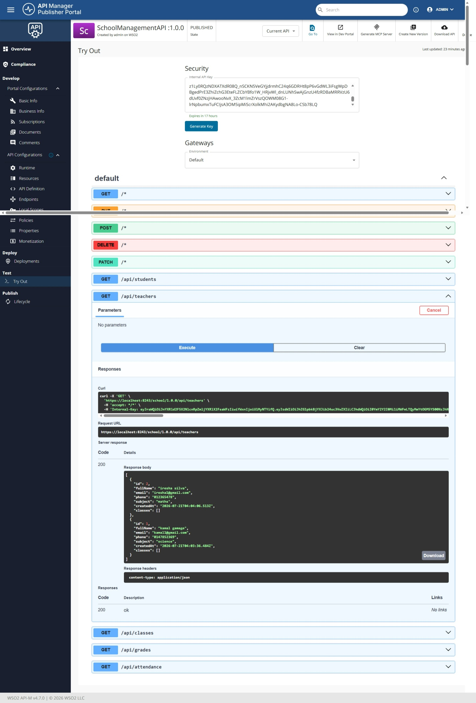

# School Management System

A full-stack School Management System built with **Next.js**, **Prisma**, and **PostgreSQL**, featuring authentication and integrated with **WSO2 API Manager** for centralized API security and management.

## Overview

This project demonstrates a real-world use case of WSO2 API Manager by:
- Managing a complete school system (Students, Teachers, Classes, Attendance, Grades)
- Securing the application with a custom login/authentication system
- Exposing backend API endpoints through WSO2 API Manager
- Testing endpoints live through the WSO2 Publisher Portal's Try Out feature

## Features

- **Dashboard** - Overview of students, teachers, classes, attendance, and grade statistics
- **Student Management** - Add, edit, delete, and view student records
- **Teacher Management** - Manage teacher profiles and subject assignments
- **Class Management** - Organize classes and assign teachers
- **Attendance Tracking** - Record and manage daily attendance
- **Grade Management** - Track student grades and exam records
- **Authentication** - Secure login system with hashed passwords (bcrypt) and session-based route protection

## Tech Stack

- Next.js 16
- Prisma ORM
- PostgreSQL (hosted on Neon)
- bcryptjs (password hashing)
- TypeScript
- WSO2 API Manager 4.7.0

## Backend API Endpoints

| Method | Endpoint | Description |
|--------|----------|--------------|
| GET/POST | /api/students | Manage student records |
| GET/POST | /api/teachers | Manage teacher records |
| GET/POST | /api/classes | Manage class records |
| GET/POST | /api/attendance | Manage attendance records |
| GET/POST | /api/grades | Manage grade records |
| POST | /api/auth/login | User login |
| POST | /api/auth/logout | User logout |

## Running the Project

```bash
npm install
npx prisma generate
npx prisma migrate dev
npx prisma db seed
npm run dev
```

Server runs on `http://localhost:3000`

**Default login credentials:**
- Username: `admin`
- Password: `admin123`

## Authentication

The application is protected with a custom authentication system:
- Passwords are hashed using bcrypt before storage
- Login sessions are managed via HTTP-only cookies
- Middleware protects all routes, redirecting unauthenticated users to the login page


## WSO2 API Manager Integration

The backend API was published through WSO2 API Manager as **SchoolManagementAPI v1.0.0**:
- **Context**: `/school`
- **Backend Endpoint**: `http://localhost:3000/api`
- **Security**: OAuth2

### Published API on WSO2 Publisher Portal



### Live Test via WSO2 Try Out Feature

Successfully tested the APIs via the WSO2 Try Out feature, receiving live `200 OK` responses with real data routed through the WSO2 API Gateway.

#### Students API

The Students API was successfully tested using the `GET /api/students` endpoint, returning real student data through the WSO2 gateway:



#### Teachers API

The Teachers API was also successfully tested using the `GET /api/teachers` endpoint, returning real teacher data through the WSO2 gateway:


## Tech Highlights

This project showcases:
- Full CRUD operations across 5 related database models
- Custom authentication (not a third-party auth provider)
- Route protection via Next.js middleware
- Real-world API management using WSO2 API Manager